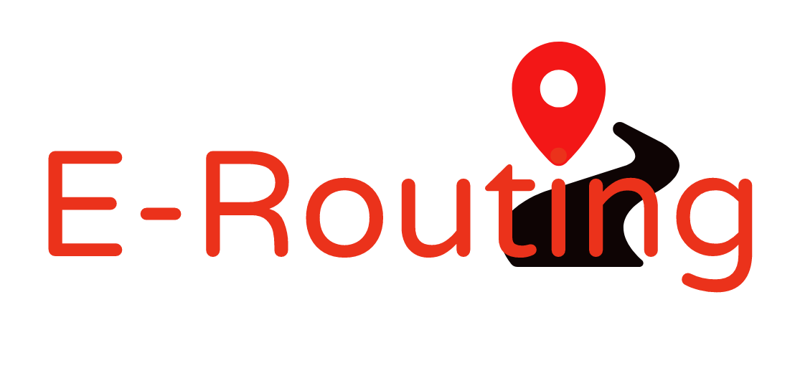

# 
#### Tim:
1. Mirza Delibašić
2. Envera Husagić
3. Naida Hanjalić

## Opis Teme:
E-Routing je servis za cestovnu navigaciju koji prilikom određivanja optimalne rute vožnje uračunava i trenutno stanje na putevima, tj. zastoje, saobraćajne nesreće i slične okolnosti koristeći informacije sa lica mjesta. Korisnici svojim dojavama obavještavaju o trenutnim događajima koji postaju vidljivi svim ostalim korisnicima.

## Procesi:  

### Registracija korisnika
Novi korisnici samostalno kreiraju svoje račune unoseći svoje ime, prezime, e-mail, te kreiraju username i password.

### Prijava korisnika
Postojeći korisnik prijavljuje se unoseći svoj username i password.

### Određivanje optimalne rute
Prijavljeni korisnik unosi početnu i krajnju lokaciju na osnovu čega se određuje najbrži cestovni put između te dvije lokacije, koji se korisniku prikazuje na karti uzimajući u obzir izbjegavanje puteva sa trenutnim problemima. 

### Slanje dojave o stanju na putevima
Korisnik odabere koju vrstu oznake na putu želi da postavi, koliko procjenjuje da je trenutno čekanje i pošalje dojavu. Na osnovu njegove trenutne lokacije ta oznaka se stavlja na kartu i postaje vidljiva ostalim korisnicima kojima se automatski mijenja ruta, na način da se traži sljedeći najkraći cestovni put do krajnje tačke. 

### Uređivanje dojave
Da bi se izbjeglo lažno dojavljivanje, korisnici mogu postojeću dojavu označiti tačnom ili pogrešnom ukoliko se nalaze u blizini, kao i dodati vlastitu procjenu o vremenu čekanja, ili označiti da je zastoj uklonjen. Dojave sa više 'poena' imat će prioritet prilikom navigacije.

## Funkcionalnosti:
⦁	Registracija korisnika

⦁	Prijava korisnika

⦁	Izračunavanje cestovne rute

⦁	Ažuriranje rute na osnovu stanja na putu

⦁	Slanje obavijesti u slučaju promjene rute (ili promjene vremena dolaska)

⦁	Slanje dojave od strane korisnika

⦁	Pregled i uređivanje vlastitih dojava

⦁	Pregled mape sa događajima

⦁	Recenzija postojece dojave

⦁	Pregled statistike o putovanjima, destinacijama itd.

## Akteri:
### 1. Administrator 
Ima pregled svih dojava, mogućnost uređivanja i brisanja svih dojava, korisnika, potpune statistike koristenosti aplikacije itd.
### 2. Korisnik
Ima pregled mape, mogućnost unosa dojave, navigacije i uređivanja dojava
### 3. Sistem za navigaciju
Omogućava kalkuliranje rute između početne i krajnje lokacije
